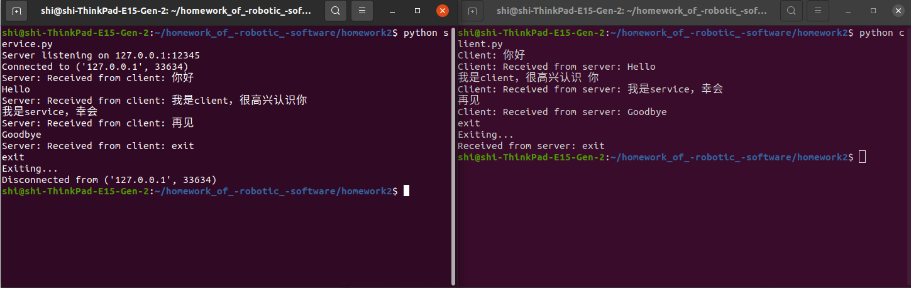

# Homework2介绍

## 实验内容

本实验使用Python语言编写基于Socket和多线程的简单聊天程序。实验包括一个服务端程序service.py和一个客户端程序client.py。每个程序包含一个线程用于接收并显示对方发出的消息，另一个线程用于处理本方输入并发出消息。聊天程序能够在双方连接后进行实时通信，并在用户输入 "exit" 后安全退出。

## 文件架构
```
- Homework2/
    - client.py：客户端
    - server.py：服务端
    - fig.png：实验结果展示
```

## 结果展示
首先运行service.py文件，再运行client.py文件，即可进行简单聊天，并在用户输入 "exit" 后安全退出。。


