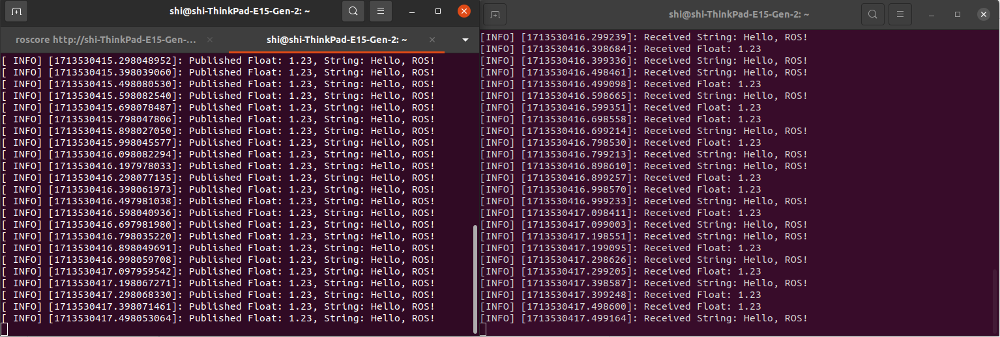

# Homework3介绍

## 实验内容

- 创建一个 C++ 编写的发布器节点，发布两种类型的消息：浮点数和字符串。
- 创建一个 Python 编写的订阅器节点，订阅这两种类型的消息，并将其打印出来。

## 文件架构

```
- Homework3/
    - talk.cpp：C++编写的发布器
    - listen.py：Python编写的订阅器
    - CMakeLists.txt：用于编译talk.cpp
    - fig.png：实验结果展示
```

## 实验结果
注：实验中使用的Python环境为Python 3.8

运行方法：
1. **创建Package**: 创建一个名为hello_pkg的包，并将文件放于其中。

2. **编译代码**: 在工作空间目录下使用catkin_make进行编译。
    ```bash
    catkin_make
    ```

3. **运行代码**: 开启三个终端，分别运行以下命令。
    ```bash
    roscore
    ```
    ```bash
    rosrun hello_pkg listen.py
    ```
    ```bash
    rosrun hello_pkg talker
    ```

实验结果如下所示：


